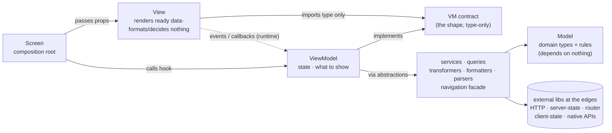

# rn-mvvm-guardian — React Native MVVM (stack- and structure-agnostic)

Keep a React Native app faithful to MVVM, SOLID, best practices, and conventions —
and scale it only when the pain is real, climbing one deliberate rung at a time.
(**MVVM** = Model–View–ViewModel; **SOLID** = the five design principles Single
Responsibility, Open–Closed, Liskov Substitution, Interface Segregation, and
Dependency Inversion — all defined in the
[`conventions.md`](references/conventions.md#glossary) glossary and worked example
by example in [`mvvm-and-scaling.md`](references/mvvm-and-scaling.md#solid--the-five-principles-in-plain-terms-and-in-mvvm).)
**This skill mandates no stack and no structure.** It teaches the MVVM *boundaries*;
you choose the libraries that plug into them (navigation, server state, HTTP, client
state) and the structure that fits the app (screen-based → feature-based → modular
monolith → micro-frontend), and the skill keeps those choices from leaking across
the boundaries.

The cheatsheet (a one-screen index) plus **eight deep references** (suggested reading
order: **skim `cheatsheet.md`** for the 60-second orientation, then **`mvvm-and-scaling.md`**
for the contract and `triad-example.md` to see it in code; reach for `triad-advanced.md`,
`triad-crosscutting.md`, `conventions.md`,
`stack-choices.md`, `worked-examples.md`, and `integration-recipes.md` as the task needs them):
- [`references/cheatsheet.md`](references/cheatsheet.md) — the one-screen digest: the
  triad table, where-does-X-go, the red flags, the ladder, the gates, and naming — each
  row pointing at the deep reference that expands it. Start here.
- [`references/mvvm-and-scaling.md`](references/mvvm-and-scaling.md) — the layer
  contract, conformance checklist, and the scaling ladder + migration playbooks.
- [`references/triad-example.md`](references/triad-example.md) — the triad in
  **code**, the **core slice** (sections 0–9): starts with a ~40-line **quickstart**
  (section 0) — the smallest faithful slice — then the full
  Model→Service→transformer→formatter→neutral-hook→ViewModel→View→Screen slice, the VM
  contract as a discriminated union, controlled inputs, and the tests.
- [`references/triad-advanced.md`](references/triad-advanced.md) — the **harder cases**
  (sections 10–18): controlled inputs/forms, the Open–Closed Principle (OCP) via a
  registry, the no-server-state-lib path, the god-component refactor, typed route params,
  **mutations** (optimistic update + rollback), an error boundary, **the same triad on
  MobX / RTK Query / Redux** (the universality claim in code), and pagination.
- [`references/triad-crosscutting.md`](references/triad-crosscutting.md) — the
  **cross-cutting slices** (sections 19–23): **i18n, accessibility, animations, and
  Suspense** — each kept on the right side of the boundary — plus a closing
  **referenced-helpers appendix** listing every assumed primitive.
- [`references/conventions.md`](references/conventions.md) — the glossary, naming
  rules, canonical folder trees, how to model VM state, the **adoption ladder**
  (build the fewest layers you need), and what this material does not yet cover.
- [`references/stack-choices.md`](references/stack-choices.md) — the menu of
  library options per concern, **where each plugs into the boundaries**, and how
  swappable each is.
- [`references/worked-examples.md`](references/worked-examples.md) — a concrete,
  copy-pasteable instantiation (Expo + expo-router + TanStack Query + Zustand +
  axios): conformance greps, the feature-boundary ESLint recipe, the `AuthBridge`
  dependency inversion, server-state/client-state specifics, and a worked
  screen→feature migration — **plus section 10, the same recipes on a contrasting stack**
  (bare RN + React Navigation + Redux Toolkit + fetch), changing imports only. Keep
  the pattern, swap the specifics for your libs.
- [`references/integration-recipes.md`](references/integration-recipes.md) — the
  previously-deferred integration concerns worked in code: **observability, real-time,
  offline-first/sync, GraphQL, deep linking, and security** — each kept behind one
  layer's neutral contract (built on the triad, the `AuthBridge`, route-param parsing,
  and the neutral data hook), so the VM/View never change when you swap the library.

## The core idea

> The **Model–View–ViewModel triad** and every layer's responsibility never
> change — not when the app grows, and **not when you swap a library**. What
> changes is only *how files are grouped* (the rung) and *which library sits
> inside a layer*. Climbing the ladder is a reorganization, not a rewrite; and a
> library swap is a one-layer change, not an app-wide one — **if** the boundaries
> are respected.

**Why MVVM here, and when not to.** This is **React / Passive-View MVVM** —
unidirectional props-down / callbacks-up, *not* the two-way data-binding MVVM of
.NET/Android/SwiftUI. The contract takes a deliberately **strict, "passive View"
stance** (closer to MVP's Passive View than textbook MVVM — see the note in
[`references/mvvm-and-scaling.md`](references/mvvm-and-scaling.md) [section 1](references/mvvm-and-scaling.md#1-layer-responsibilities-the-contract)): all
formatting and decisions leave the View, so each layer has one reason to change and
is testable in isolation. That discipline **earns its keep on apps that will grow,
be maintained by more than one person, or live for years.** On a throwaway prototype
or a two-screen app it can be overhead — start at the [section 0 quickstart](references/triad-example.md#0-quickstart--the-smallest-faithful-slice-rung-1-40-lines)
(Model + View + ViewModel + Screen, one service, one formatter) and add layers only
when a *distinct reason to change* appears (the **adoption ladder** in
[`references/conventions.md`](references/conventions.md)). The skill flags
**over-building as readily as under-structuring**.

## The five rules (the whole contract in one breath)

If you read nothing else, internalize these — every reference just expands one of them:

1. **One reason to change per file.** Each piece of code lives in the layer that owns
   its reason to change. One edit forcing three layers = a responsibility leaked.
2. **The View is passive.** It renders the branch the VM resolved and forwards events —
   it formats nothing, decides no loading/error/empty, and imports no service/store/
   query/router.
3. **The ViewModel is UI-free.** No `react-native` import, no JSX; it holds state +
   handlers and exposes a discriminated `status` of *ready* values. It depends on
   abstractions (facade, neutral hooks, pure mappers), never on a concretion.
4. **Every library lives behind one layer's contract.** HTTP in `services/`, the router
   behind a `navigation/` facade, server-state behind a neutral `queries/` hook, client
   state behind selectors — so a swap touches one layer, not the app.
5. **Build the fewest layers that earn their keep, scale only when the pain is real.**
   A missing layer is not a defect; over-building is flagged as readily as under-structuring.

The fastest concrete start is the **~40-line section 0 quickstart** in
[`references/triad-example.md`](references/triad-example.md) — copy it, then add layers
only when a distinct reason to change appears. Reach for the deep references on demand;
nothing below is required reading before you write your first triad.

## Getting started in your project (any stack)

A linear path for adopting the contract in a real app. Each step links to the
reference that details it — nothing here is duplicated, only sequenced.

1. **Configure the `@/` path alias** in the two places that must agree — the
   type-checker (`tsconfig.json`) and the Metro runtime (`babel.config.js`). See
   "Assumed tooling" in [`references/conventions.md`](references/conventions.md).
2. **Create the minimal folder tree** for your starting rung — at Rung 1 that's the
   screen-based tree (`screens/`, `models/`, `services/`, `shared/`, and the mapping
   folders you actually need). Canonical trees: [`references/conventions.md`](references/conventions.md).
3. **Write your first triad from the quickstart** — Model + View + ViewModel + Screen,
   one service, one formatter. Copy [section 0 of `triad-example.md`](references/triad-example.md#0-quickstart--the-smallest-faithful-slice-rung-1-40-lines)
   and adapt the imports to your libraries.
4. **Keep each library behind its layer** as you add navigation, server state, HTTP,
   and client state — pick from the menu in [`references/stack-choices.md`](references/stack-choices.md)
   and confirm consumers depend on the *layer's contract*, not the lib.
5. **Wire the gates into CI + pre-commit** — `tsc --noEmit` = 0, lint = 0, tests green.
   The minimal CI job is in [`mvvm-and-scaling.md`](references/mvvm-and-scaling.md) [section 7](references/mvvm-and-scaling.md#7-keeping-it-faithful-over-time-governance).
6. **Add layers and climb rungs only when a distinct reason to change appears** — the
   adoption ladder ([`references/conventions.md`](references/conventions.md)) and the
   scaling decision tree ([`mvvm-and-scaling.md`](references/mvvm-and-scaling.md) [section 3](references/mvvm-and-scaling.md#3-the-scaling-ladder)).
   When you reach feature-based, add the boundary-enforcing ESLint rules from
   [`worked-examples.md`](references/worked-examples.md) [section 2](references/worked-examples.md#2-feature-boundary-lint-recipe-eslint-flat-config-no-extra-plugins).

Want a concrete, copy-pasteable instance of every recipe on one stack (Expo +
expo-router + TanStack Query + Zustand + axios)? See
[`references/worked-examples.md`](references/worked-examples.md) — and [section 10](references/worked-examples.md#10-the-same-recipes-on-a-contrasting-stack-bare-rn--react-navigation--redux-toolkit--fetch) for the
same recipes on a contrasting stack (bare RN + React Navigation + Redux Toolkit + fetch).

## Activation flow

1. **Detect the stack and the rung.** Which navigation lib, server-state
   approach, HTTP client, client-state lib? Is it organized by screen, by
   feature, or as packages? (Both are fine — the skill adapts.)
2. **Run the conformance checklist** (see `mvvm-and-scaling.md`). Report findings
   with `file:line` + severity. The checks are stack-neutral: the triad
   discipline, the layer Must/Must-not contracts, SOLID, and (feature-based+) the
   boundary enforcement.
3. **On a stack choice or change** ("should we use TanStack Query? can we drop it?
   swap the router?"), use `stack-choices.md`: confirm the library lives only in
   its layer, and that consumers depend on the *layer's contract*, not the lib.
   Recommend an adapter when a library's shape is leaking.
4. **On scaling**, run the decision tree and emit a phased migration plan.
   Recommend the *lowest* rung that fits — each rung adds isolation **and** cost.

## The triad + its composition root (the part that never changes)

- **Model** — what the data *is* + domain rules. Depends on nothing.
- **View** — what the screen *looks like*: renders ready data, forwards events,
  **decides nothing, formats nothing**.
- **ViewModel** — what the screen *does*: state, handlers, "what to show". It is
  **UI/JSX-free** (no `react-native` import, renders no JSX), has no knowledge of the
  View, and is tested via its contract with `renderHook`. It is **typically** a React
  hook: `useState`/`useEffect`/`useMemo` and the feature's own neutral hooks (e.g.
  `useProductsData()`) are fine — the rule is **no UI/rendering dependency, not "no
  React."** Effects and lifecycle (fetch on mount, refetch on focus, cleanup) live
  here too, never in the View.
  > **Two clarifications.** (1) In hook-centric stacks the VM *is* a React hook; in
  > observable stacks like **MobX** it may be an observable class/object the screen
  > consumes through a thin hook — either is fine as long as it stays UI-free and is
  > verified through its contract. (2) The VM consumes neutral hooks, never the libs
  > directly: focus effects come through the navigation facade's neutral focus hook
  > (not the router's `useFocusEffect`), and data comes through the feature's query
  > hook (not the server-state lib's `useQuery` — see the result-shape leak red flag).
- **Screen** — the **per-screen composition root** that wires the triad: it calls the
  ViewModel hook and passes its output into the View as props. Not part of the
  classic MVVM triad, but an invariant role here (no state/JSX/styles/logic of its
  own). Because the View receives the VM's output rather than calling the hook
  itself, a test can render it with a fake VM that satisfies the contract.

**Dependency direction (modules).** `Screen → ViewModel` (calls the hook) and
`Screen → View` (passes props). The ViewModel depends on services / queries / mappers
/ navigation — all behind abstractions. The View's **only dependency on the ViewModel
layer** is its props contract: a **standalone module** (`<Screen>VM`, the shape the VM
produces) that both the View and the VM import — never the VM's *implementation* (the
hook) or services. Data flows VM → (props) → View; events flow View → (callbacks) → VM.
Libraries sit at the edges, behind those abstractions, and a fake VM satisfying the
contract can render the View in a test.

> **Why the contract lives in its own module.** Keeping `<Screen>VM` in its own file
> is what lets the View avoid importing the hook at all. Because the View imports it
> `type`-only, the import is erased at compile time — no runtime coupling and no DIP
> violation either way. The "never import the hook" rule is about **runtime/value**
> imports only.
>
> **The View's other imports are fine.** "Depends only on the contract" is about the
> *VM relationship* — the View still imports `react-native` and shared presentational
> components, naturally.
>
> **Rung 1 shortcut.** A tiny app may co-locate the contract type in the hook file;
> the View still imports it `type`-only (erased), so there's no coupling either way.
> Split it into its own file as the feature grows (see
> [`references/conventions.md`](references/conventions.md)).

Solid arrows are the **dependency direction** (a box depends on what it points to).
The dashed `View ⇢ VM` arrow is the exception: it shows **events flowing at runtime**
(callbacks), *not* a dependency — the View's only compile-time dependency is the
standalone *contract module* (`<Screen>VM`), which both it and the VM import (the VM
*implements* it, the View imports it `type`-only). The **Model** (domain types +
rules) is depended on by the edge layers and depends on nothing.

## The boundaries that make stack choice safe

Every external library is confined to one layer, and the rest of the app depends
on that layer's *contract*, not the library:

- **Navigation lib** → a `navigation/` facade (+ route param/title hooks). VMs
  call the facade, never the router.
- **HTTP client** → `services/` (+ a `client` factory). The only layer that
  imports the HTTP lib; it returns typed data and classifies transport errors
  into domain errors.
- **Server-state lib** → `queries/` + `mutations/`. VMs consume the hooks'
  return shape (ideally a neutral feature-defined shape, so the lib stays swappable).
- **Client-state lib** → `stores/`, accessed via selectors. Cross-layer teardown
  (e.g. logout) lives in a coordinator, not the store.
- **Native/device APIs** (camera, location, notifications, biometrics, filesystem,
  permissions) → a `services/` adapter (or a device port) behind an abstraction.
  VMs depend on the typed result + domain errors, never on the native module.

This is why "can I swap TanStack Query / the router / axios?" has a good answer —
see `stack-choices.md`.

## Red flags to catch (stack-neutral)

These hold whatever libraries you picked — the lib name in parentheses is just one
instance:

- A **View** formatting (`.toFixed`, date formatting, display-string templating
  like `` `@${user}` ``) or deciding error/empty/loading itself — move formatting
  to a `formatter`, expose a discriminated `status` from the ViewModel.
- A **View concentrating many independent visual blocks** (multiple cohesive UI
  sections, their inline render states, and composition logic) in one file — extract
  each cohesive block to a `components/` component and let the View **orchestrate** the
  composition. The criterion is cohesion/responsibility, not line count (and don't
  over-fragment one cohesive screen into throwaway components either).
- A **domain entity, DTO, or internal structure reaching the View** (a raw `Product`,
  a `ProductDTO`, or a query object on the VM contract instead of a formatted
  view-item) — the VM contract must expose **render-ready data + UI actions only**; run
  it through a `formatter` first.
- A **ViewModel** importing the rendering framework (`react-native`) or rendering
  JSX, or touching the router directly (e.g. expo-router's `router`, React
  Navigation's `navigation`) — move rendering to the View, navigation behind the
  facade.
- The **HTTP client** imported outside `services/` (+ its `client` factory) — e.g.
  `axios`/`fetch`/`ky` leaking into a ViewModel — confine transport.
- A **native/device API** called outside its adapter (e.g. `expo-camera`,
  `expo-location`, `expo-notifications` straight from a ViewModel/View) instead of
  behind a service/port — confine it like the HTTP client.
- A library's **result shape leaking into a ViewModel** (e.g. TanStack Query's
  `hasNextPage`/`isFetchingNextPage`) instead of a feature-defined neutral shape —
  add the neutral adapter (see `stack-choices.md`).
- **Subscribing to more state than needed** (ISP — the Interface Segregation
  Principle; depend on no more than you use). Each lib expresses this
  differently: a selector in Zustand/Redux (`useStore((s) => s.slice)`),
  `observer` + granular access in MobX, a specific atom in Jotai/Recoil. The red
  flag is subscribing to the whole store (`useStore()`) when the lib offers finer
  granularity.
- **Teardown that spans concerns** (logout = clear state + clear server-cache +
  navigate) living inside a store — it belongs in a coordinator, not the store.
- **Server state hand-duplicated into a client store** instead of living in the
  server-state layer (queries/mutations). (A server-state *library* that caches in
  the store by design — RTK Query's API slice, Apollo's normalized cache — IS the
  server-state layer and is fine; the anti-pattern is a hand-rolled client slice
  mirroring server data, which can drift.)
- Feature-based and up: **deep cross-feature imports** (reaching past a feature's
  public `index.ts`) or **`shared/` importing a feature** — both break the boundary.

The concrete greps that catch these for one stack are in
[`references/worked-examples.md`](references/worked-examples.md); adapt them to
your libs.

## Scope
Stack-agnostic and structure-agnostic: any RN app, any rung, any lib choice — this
single skill covers review, stack-choice advice, and scaling. When you want a
concrete, ready-to-copy template, the Expo + TanStack Query instantiation lives in
`worked-examples.md`.

**Assumes TypeScript** and **Jest + React Native Testing Library** (with
`renderHook`) — the type-contract testing, the `tsc --noEmit` gate, the "no `any`"
rule, and the fake-VM/VM tests rely on them. On a JS-only project the layer
contracts become convention + JSDoc/PropTypes and the `tsc` gate doesn't apply;
everything else holds.

**Worked as integration recipes** (each confined to one layer behind a neutral
contract — see [`references/integration-recipes.md`](references/integration-recipes.md)):
observability, real-time/streaming, offline-first/sync, GraphQL, deep linking, and
security. Apply the same rule everywhere — confine the library to one layer behind a
neutral contract.
The **New Architecture** (Fabric/TurboModules/JSI) — now the default in current
React Native — is orthogonal: it changes the *native* layer, not the triad (native
modules behind a `services/` device adapter; worklets/animations in a UI hook or the
View; never the VM).

Read the references the task needs before producing findings or a plan — skim the
cheatsheet first, then **all the deep references for a full conformance audit or a
migration** (where every layer, the stack-choice advice, and the scaling playbooks are
in scope). For a narrow question (e.g. "where does a formatter go?"), the relevant
reference is enough.
